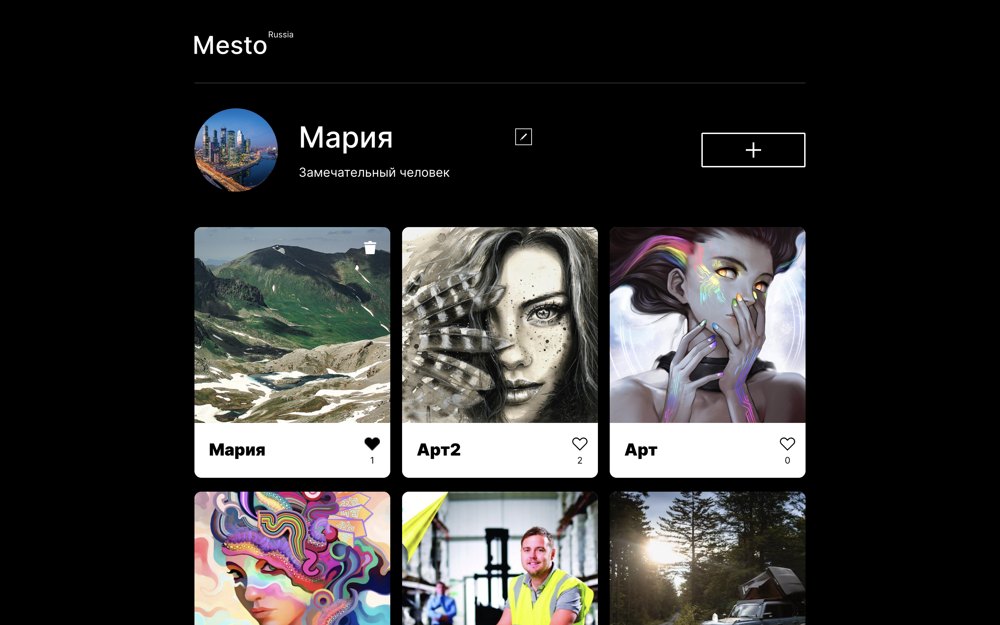

<h1 align="center">Mesto. Опыт путешественников</h1>
<h2 align="center">Проектная работа в рамках обучения на Я.Практикуме</h2>

<h2 align="center"> Используемые технологии &#128187;</h2>

- JavaScript
- Git
- Webpack
- HTML
- CSS

<h2 align="center">Описание проекта &#128444</h2>

Проект представляет собой сервис, в котором можно делиться различными картинкам.

Пользователь может добавить новое место, указав его название и добавив ссылку на картинку данного места, может поставить лайк понравившеся картинки или убрать его, а также удалить добавленные карточки.

Реализована возможность именения картинки профиля, имя пользователя и его описание.

Также на странице можно нажать на картинку и отобразиться модальное окно, в котором можно более подробно посмотреть изображение.

<h2 align="center"> Инструкция по развертыванию &#128212;</h2>

Хотите попробовать в использовании данный ресурс?

1. Клонируйте данный репозиторий локально
2. Запустите фронтэнд командой npm run dev
3. Наслаждайтесь функционалом &#127881;

<h2 align="center"> Планы по доработке проекта &#128221; </h2>

- Реализовать возможность изменения аватара пользователя
- Добавить возможность редактирования существующих карточек - название, картинка
- Создать обработчики и отправку данных
- Регистрация пользователя
- Авторизация пользователя

<h2 align="center"> Дополнительная информация &#128222;</h2>

- [Ссылка на макет в Figma](https://www.figma.com/file/2cn9N9jSkmxD84oJik7xL7/JavaScript.-Sprint-4?node-id=0%3A1)